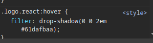
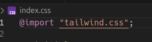

# another attempt on react

> using tailwind, daisyUI.. the usual suspects.

## History

```bash
# npm install -g npm@11.3.0  # to use new stable node v.23.6.1
npm create vite@latest . # using react + JS, then
npm install # split terminal and
npm run dev
```

create .env: `touch .env .env.local`

---

_looove that shadow, by the way:_



---

### CSS: adding tailwind + daisy UI

> see [tailwind + vite](https://tailwindcss.com/docs/installation/using-vite)

```bash
npm install tailwindcss @tailwindcss/vite
```

> in vite.config.js add:

```javascript
import tailwindcss from "@tailwindcss/vite";
```

> should look like:

```javascript
import { defineConfig } from "vite";
import react from "@vitejs/plugin-react";
import tailwindcss from "@tailwindcss/vite";

// https://vite.dev/config/
export default defineConfig({
  plugins: [react(), tailwindcss()],
});
```

#### just in case..

```bash
nvm use 22 && rm -rf node_modules package-lock.json && npm i
```

#### but the issue was PEBKAC, as usual:



#### without a dot, of course. `@import "tailwindcss";`

whatever. proceed..

```bash
npm i -D daisyui@latest

```
